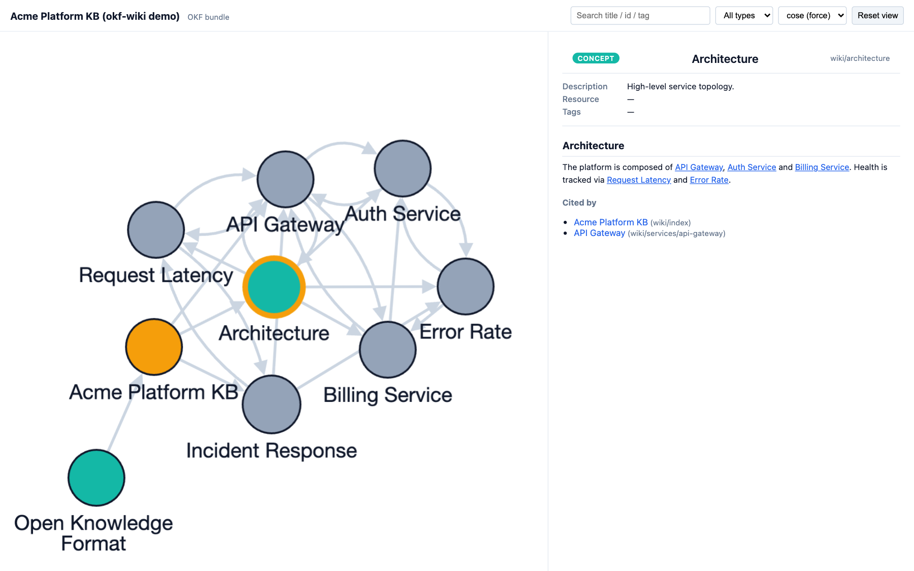

# okf-wiki

**A local, OKF-compatible knowledge engine for AI agents.**
Capture your Codex / Claude / Gemini sessions, retrieve them with hybrid
semantic + keyword search, serve them to *every* agent harness over MCP,
visualize them as an interactive graph, and export to a portable
[Open Knowledge Format](https://github.com/GoogleCloudPlatform/knowledge-catalog)
bundle.


---

## What is this?

Google's **Open Knowledge Format (OKF)** standardized *how* to store agent
knowledge — markdown files with YAML frontmatter. It deliberately leaves out the
hard parts: retrieval, capture, serving, and enforcement.

**okf-wiki is that missing engine.** Point it at a directory of markdown notes
(an OKF bundle) and it becomes a living, queryable, agent-served knowledge base.

| | OKF (the format) | okf-wiki (the engine) |
| --- | --- | --- |
| Storage format | ✅ markdown + frontmatter | uses OKF |
| Retrieval | — (out of scope) | ✅ hybrid semantic + keyword (RRF) |
| Capture | — (BigQuery agent only) | ✅ Codex / Claude / Gemini sessions |
| Serving to agents | — | ✅ one MCP server, every harness |
| Visualize | static viewer | ✅ interactive graph |
| Privacy | unspecified | ✅ secret scrubbing + sensitivity gate |

okf-wiki **produces and consumes** OKF v0.1 bundles — it rides the standard, it
doesn't replace it.

---

## See it

Every page is a node; every cross-link is an edge. Search, filter by type,
switch layouts, and read any concept with its backlinks — all in one
self-contained HTML file (no server):



*Generated from the public demo bundle in [`examples/demo`](examples/demo) with
`okf-wiki viz`. Your own graph stays local.*

---

## Quickstart

```bash
# install (from a clone)
pip install -e .              # add ".[neural]" for real multilingual embeddings
                              # add ".[yaml]"  for robust YAML frontmatter

# point at your knowledge bundle (default: ~/llm-wiki)
export OKF_WIKI=~/llm-wiki

# 1. capture your agent conversations (Codex / Claude Code / Gemini)
okf-wiki ingest

# 2. build the semantic index
okf-wiki index

# 3. search (hybrid semantic + keyword)
okf-wiki search "what did I decide about the auth refactor"

# 4. visualize -> writes viz.html you can open in any browser
okf-wiki viz

# 5. export a portable OKF bundle
okf-wiki export --out ./okf-bundle

# 6. serve to your agents over MCP (stdio)
okf-wiki serve
```

Try it on the bundled demo with no setup:

```bash
okf-wiki viz --wiki examples/demo --out demo.html && open demo.html
```

---

## Wire it into your agents (one command)

okf-wiki registers itself into every harness it detects — registering the MCP
server *and* a wiki-first routing block, so your agents actually consult the
wiki:

```bash
okf-wiki install            # detect + wire (backs up every file it touches)
okf-wiki install --check    # show wiring status
okf-wiki install --dry-run  # preview, change nothing
okf-wiki install --uninstall
```

| Harness | Capability | Enforcement |
| --- | --- | --- |
| **Claude Code** | MCP server + `.mcp` | SessionStart / UserPromptSubmit hooks inject wiki context |
| **Codex CLI** | `[mcp_servers.okf-wiki]` in `config.toml` | AGENTS.md routing (+ opt-in `user_prompt_submit` hook) |
| **OpenCode** | drop-in `plugin/llm-wiki.js` (coexists with omo) | AGENTS.md routing |
| **anything MCP** | `okf-wiki serve` (stdio) | AGENTS.md routing |

Or register the stdio server manually anywhere MCP is supported:

```json
{ "command": "okf-wiki", "args": ["serve", "--wiki", "/path/to/bundle"] }
```

---

## How it works

```
  ~/.codex  ~/.claude  ~/.gemini        markdown bundle (OKF)
        \       |        /                      |
         ▼      ▼       ▼                        ▼
   ingest (sessions) ───────────────►  raw/manifests/*.jsonl
                                               │
                              index (hashing or neural embeddings)
                                               │
        ┌──────────────┬───────────────┬───────┴────────┐
        ▼              ▼               ▼                ▼
     search        serve (MCP)       viz            export (OKF)
   hybrid RRF    every harness   interactive graph   portable bundle
```

- **Capture** — reads only visible chat turns; tool output, attachments, and
  credential-looking strings are skipped or scrubbed; sensitive sessions are
  reduced to counts. Incremental: unchanged files are not re-read.
- **Retrieve** — dense cosine over an embedding index fused with a lexical
  scorer via Reciprocal Rank Fusion. Default embedder is a dependency-free numpy
  hashing encoder (Korean + English, offline, deterministic); `pip install
  ".[neural]"` upgrades to a multilingual transformer automatically.
- **Serve** — a pure-stdlib MCP stdio server exposing `wiki_answer_context`,
  `wiki_search`, `wiki_semantic_search`, and wiki pages as `okf://` resources.
- **Visualize / Export** — vendored OKF viewer renders the graph; `export`
  emits a conformant OKF v0.1 bundle (frontmatter mapped, wikilinks normalized,
  `index.md` generated).

---

## Configuration

| Setting | Env | CLI | Default |
| --- | --- | --- | --- |
| Knowledge bundle root | `OKF_WIKI` | `--wiki` | `~/llm-wiki` |
| Home root (session scan) | `OKF_HOME` | `--home` | `~` |

---

## Relationship to OKF

okf-wiki is an independent project. It targets the
[Open Knowledge Format](https://github.com/GoogleCloudPlatform/knowledge-catalog)
v0.1 specification published by Google Cloud, and bundles OKF's reference viewer
(Apache-2.0). It is not affiliated with or endorsed by Google. See [`NOTICE`](NOTICE).

## License

Apache-2.0. See [`LICENSE`](LICENSE).
